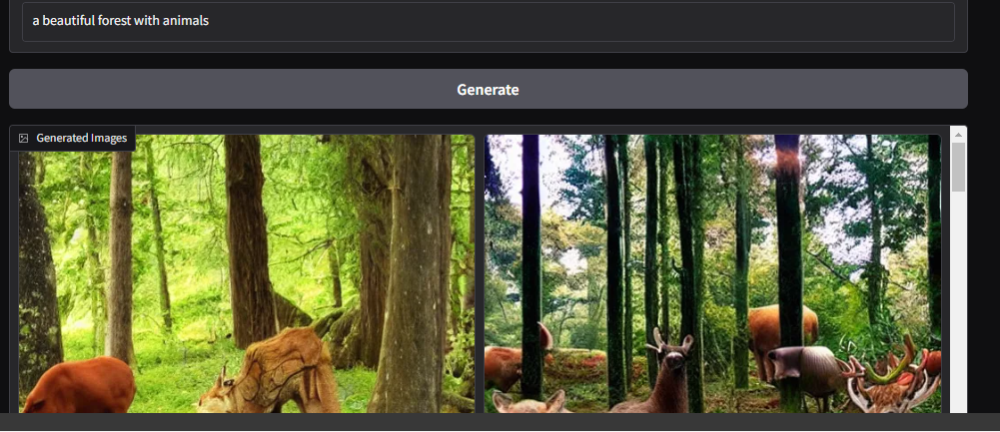

# FutureIntern_AI_02

# Image Generation with Stable Diffusion

This project leverages the **Stable Diffusion** model to generate images from text prompts using a simple and interactive **Gradio** interface. Users can input a prompt, and the system will generate multiple images based on the given description.

## Features
- Generate high-quality images from text prompts.
- Interactive interface built with **Gradio**.
- Displays up to 7 generated images in a gallery format.
- Utilizes GPU acceleration for faster image generation.

## Try It Out on Google Colab

## Demo
Here’s an example of the interface:

## Prerequisites
Before running the project locally, ensure the following are installed:
- Python 3.8 or later
- A CUDA-compatible GPU (optional but recommended for faster performance)

...

